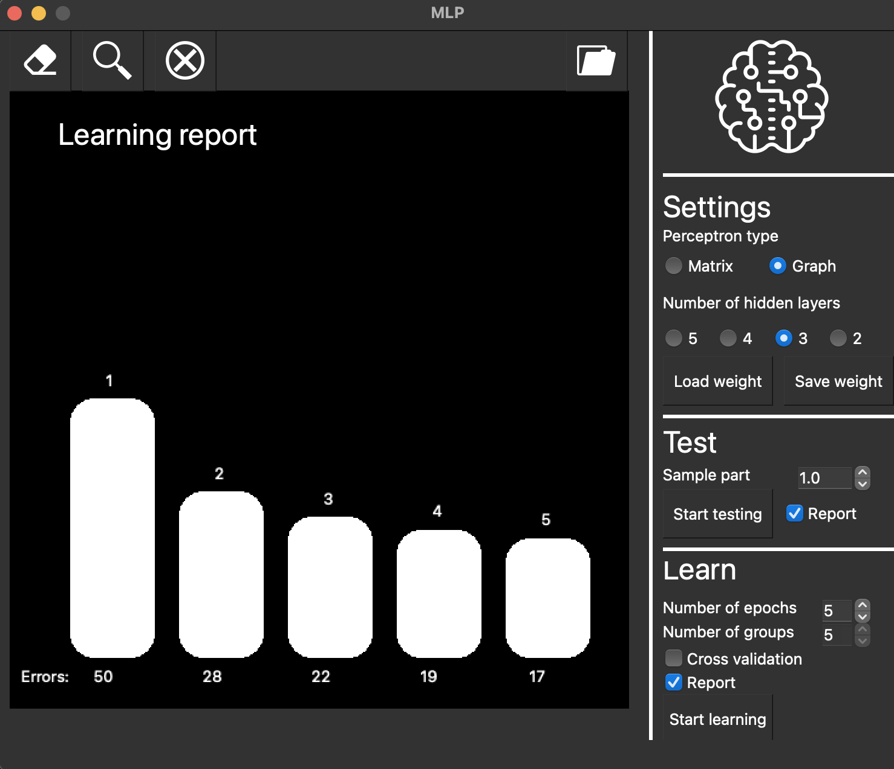
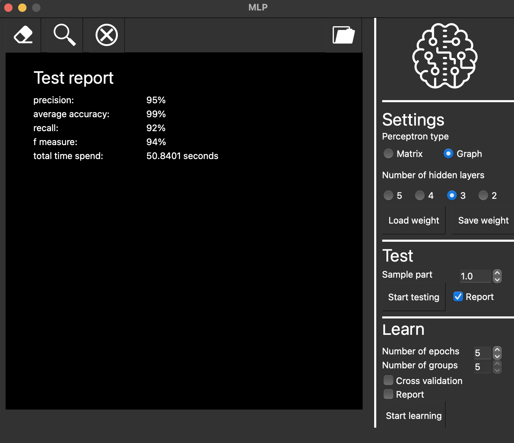

# MLP

Implementation of a basic multilayer perceptron.

The project was completed by: Balakina Ekaterina (cshara) - matrix implementation, Borisov Dmitrii (bromanyt) - graph implementation.

## Content

The project implemented a neural network that recognizes the letters of the Latin alphabet.
The neural network has two versions:
1. Matrix neural network - all layers are represented as a matrix of weights.
2. Graph - each neuron is represented by a separate object that is connected with the rest.

To build, you need: `QT 5.15.2` and higher

All the data necessary for training and testing the neural network is in the archive `src/sources/emnist_data.tar.gz`

The program is built with Makefile which contains targets: all, install, uninstall, clean, dvi, dist, tests (MacOS, Linux)
    
## Input data

In order for the neural network to be able to determine the letters on the drawn or downloaded image, it is necessary either to train
neural network, or load ready-made weights.

In the "Settings" field, you can select the type of neural network (Matrix or Graph), the number of hidden layers (2-5).

1. The image is drawn on the left side of the screen with the help of LMB (RMB to erase the drawn image). The drawn character is determined by pressing the button at the top of the screen. Further, this drawn image can be saved to the directory of your choice.
2. You can upload an image, after that it will appear on the left side of the screen, where you can determine the displayed letter.

## Training

Learning is configured in the "Learn" field:
   1. Number of epochs to train (if cross-validation is disabled) (1-5).
   2. Availability of cross-validation.
   3. Number of k-groups (if cross-validation is enabled) (1-10).
Launched by clicking on the `Start learning` button
Weights can be saved to selected directories or loaded.

After training, you can see a report on how the value of the loss function changed with increasing training epochs.

## Tests

After the neural network has been trained or the weights have been loaded, you can run tests on the specified sample
(from 0 to 1, in case of 0 - there is no test sample, tests are not run, in case of 1 - test sample is 100%)
over this neural network.
By clicking on the `Start testing` button, the test module will start and a window will open with all the main
metrics:
   1. Precision (%)
   2. Average accuracy (%)
   3. Recall (%)
   4. F-measure (%)
   5. Total time spent (sec)

Tests are carried out on a test sample that does not intersect with the training one.
