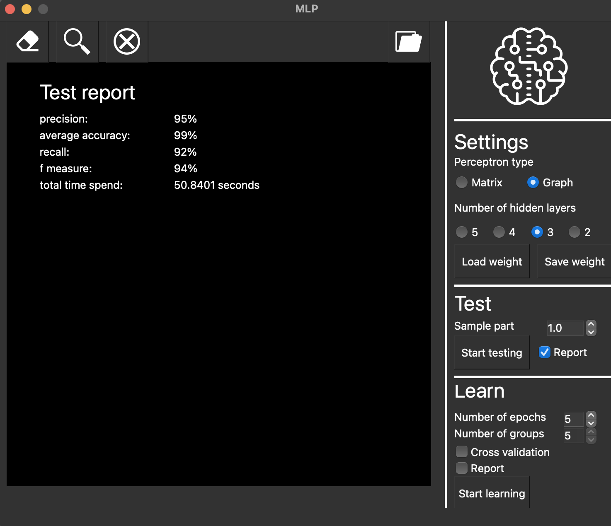

# MLP

Проект выполнили: Балакина Екатерина (cshara), Борисов Дмитрий (bromanyt).

## Содержание

В проекте реализована нейросеть, которая распознает буквы латинского алфавита.
У нейросети есть два варианта исполнения:
1. Матричная нейросеть - все слои представлены в виде матрицы весов.
2. Графовая - каждый нейрон представлен отдельным объектом который связан с остальными.

Для сборки нужны: `QT 5.15.2` и выше

Все данные необходимые для обучения и тестов нейросети находятся в архиве `src/sources/emnist_data.tar.gz`
    
## Входные данные

Для того, чтобы нейросеть могла определить буквы на нарисованном или загруженном изображении, необходимо либо обучить
нейросеть, либо загрузить уже готовые веса.

В поле "Settings" можно выбрать тип нейросети (Matrix или Graph), количество скрытых слоёв (2-5).

1. Изображение рисуется в левой части экрана с помощью ЛКМ (ПКМ для стирания нарисованного изображения). Нарисованный символ определяется при нажатии кнопки вверху экрана. Далее это нарисованное изображение можно сохранить в выбранную вами директорию.
2. Можно загрузить изображение, после этого оно появится в левой части экрана, где можно определить отображённую букву.

## Обучение

Обучение настраивается в поле "Learn":
  1. Количество эпох для обучения (если отключена кросс-валидация) (1-5).
  2. Наличие кросс-валидации.
  3. Количество к-групп (если включена кросс-валидация) (1-10).
Запускается по нажатию на кнопку `Start learning` 
Веса можно сохранять в выбранные директории либо загружать. 

После обучения можно посмотреть отчёт как изменялось значение loss-функции с увеличением эпох обучения.

## Тесты

После того как нейросеть обучилась или веса были загружены, можно провести тесты по указанной выборке
(от 0 до 1, в случае 0 - тестовой выборки нет, тесты не запускаются, в случае 1 - тестовая выборка 100%)
над данной нейросетью.
По нажатию на кнопку `Start testing` запустится тестовый модуль и откроется окно со всеми основными 
метриками:
  1. Precision (%)
  2. Average accuracy (%)
  3. Recall (%)
  4. F-measure (%)
  5. Total time spend (sec)

Тесты проводится по тестовойвыборке, которая не пересекается с обучающей.
