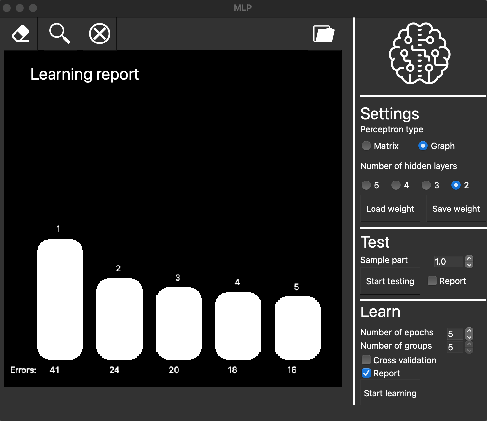
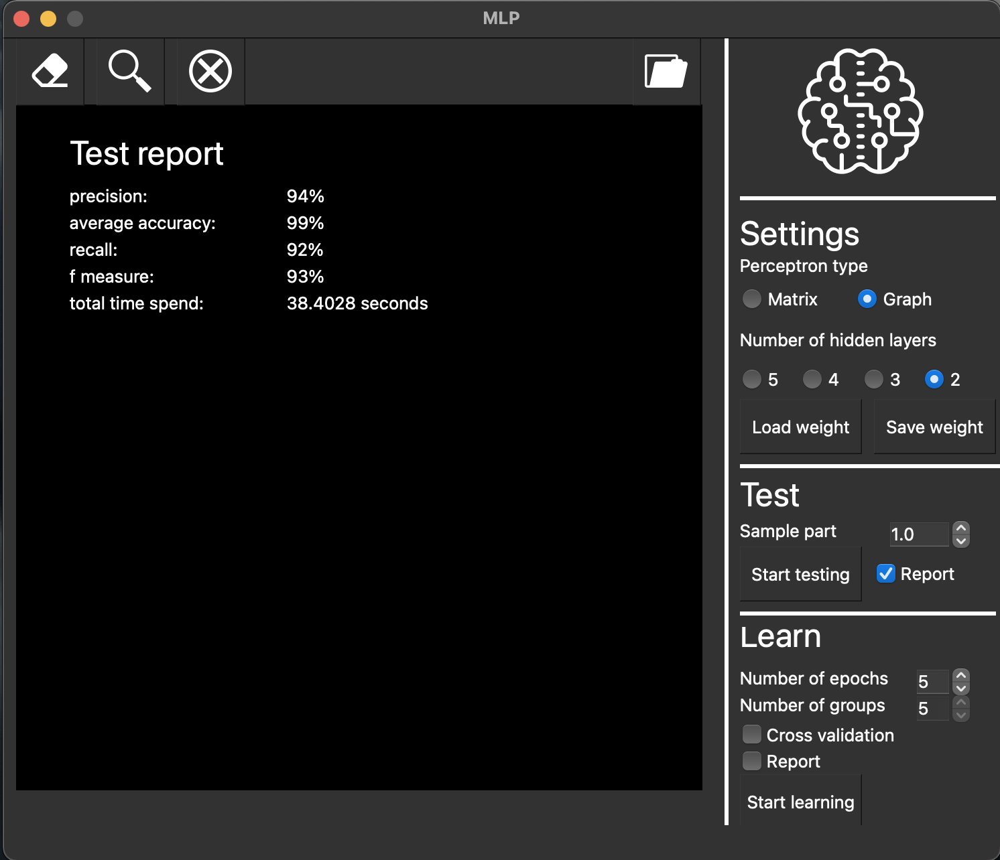
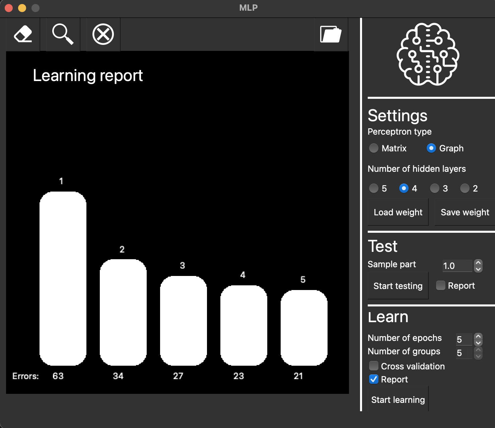
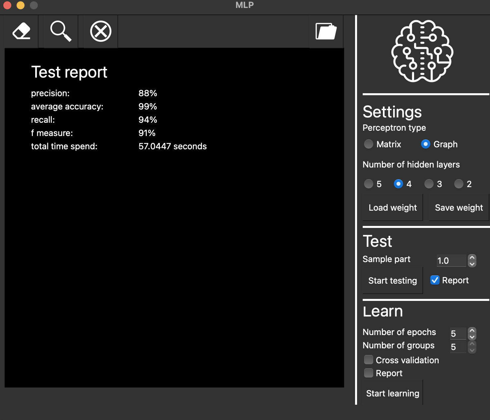
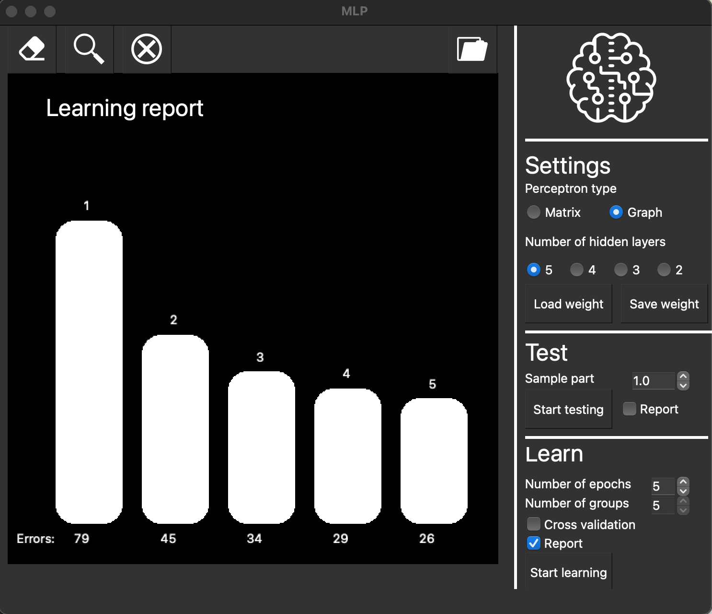
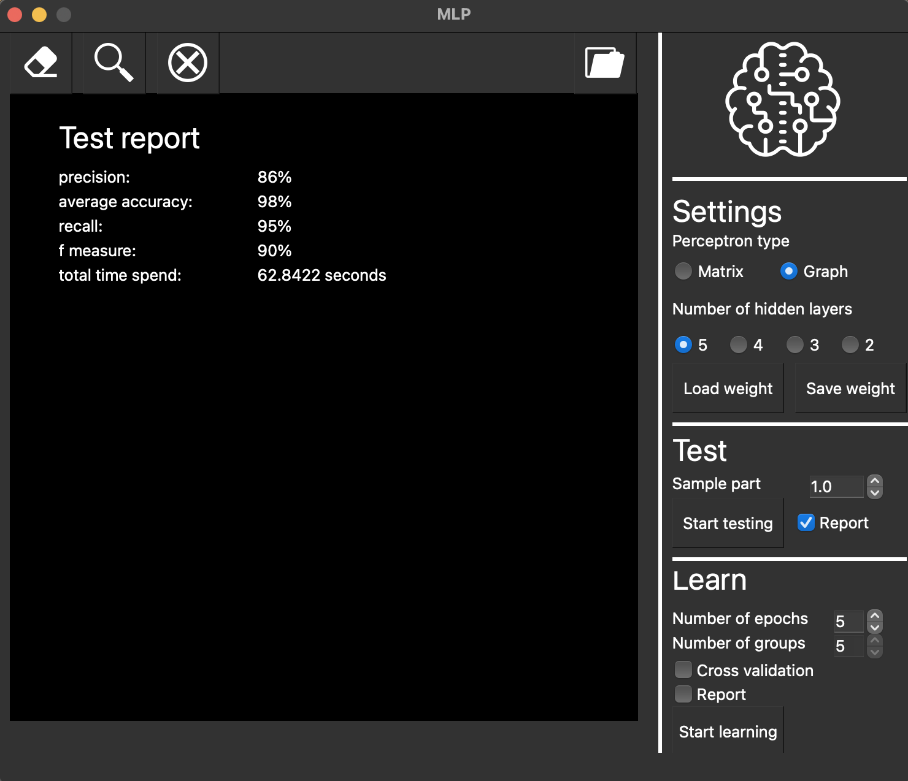

# Multilayer Perceptron

## Research

We have trained the neural network and save the obtained weights.
Loaded the same weights for matrix and graph models and perform the experiment on the test sample 10 times, 100 times and 1000 times.
Averaged and recorded the data on time spent on graph and matrix models in a table.

We used the next model for perceptron

|  | number of hidden layers | number of neurons in hidden layer| number of epochs | number of samples |
| ------------- | :-----: | :-----: | :-----: | :-----: |
| | 5| 200 | 5 | 30

and got

|  | 10 runs | 100 runs| 1000 runs | Average time of 1 run | Average time of 1 sample |
| ------------- | :-----: | :-----: | :-----: | :-----: | :-----: | 
| Matrix perceptron | 3.47857 sec. | 35.4416 sec. | 356.104 sec. | 0.35588 sec. | 0.01186 sec. |
| Graph perceptron | 7.74545 sec. | 77.8061 sec. | 772.026 sec. | 0.77259 sec. | 0.02575 sec. |

The best type is the matrix perceptron because there is multiple access to class objects in the graph case.

## Some maesurments
Also we made some maesurments.

For graph perceptron in case of 5 epoches:

### 2 hidden layers:

 

### 3 hidden layers:

 

### 4 hidden layers:

 

### 5 hidden layers:

 
